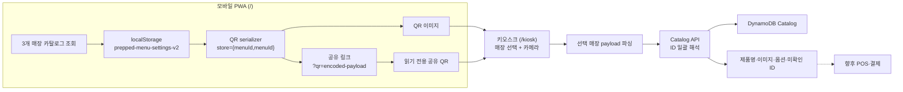

# Prepped (한끼패스)


> 가족이나 사용자가 자주 먹는 메뉴를 미리 준비하고, 시니어는 하나의 QR로 키오스크 주문 단계를 줄이는 서비스

**키오스크를 잘 쓰게 만드는 것이 아니라, 키오스크를 잘 쓸 필요가 없게 만듭니다.**

## 발표자료

[시연영상](https://drive.google.com/file/d/1ZoEu1yu1rLZzkZkSqPUHfWB79w7gghv8/view?usp=sharing)

## 심사위원 빠른 체험

별도 설치나 로그인 없이 **3~5분**이면 모바일에서 메뉴를 준비하고 키오스크가 QR을 읽어 메뉴 정보를 복원하는 핵심 흐름을 확인할 수 있습니다.

| 체험 화면 | 바로가기 | 권장 환경 | 확인할 수 있는 것 |
|---|---|---|---|
| 모바일 PWA | **[메뉴 준비하고 QR 만들기](https://hankkipass-menu-qr.meleeisdeveloping.chatgpt.site/)** | 스마트폰 브라우저 | 세 브랜드 메뉴 선택, 기기 로컬 저장, QR 생성·공유 |
| 키오스크 데모 | **[QR 스캔해 메뉴 복원하기](https://hankkipass-menu-qr.meleeisdeveloping.chatgpt.site/kiosk)** | 카메라가 있는 노트북 Chrome | 매장 선택, QR 스캔, 메뉴명·이미지·옵션 복원 |

권장 조합은 **스마트폰 1대 + 카메라가 있는 노트북 1대**입니다. 두 링크 모두 HTTPS로 제공되며, 키오스크에서 스캔을 시작할 때만 카메라 권한을 허용하면 됩니다.

### 권장 테스트 — 휴대폰 QR을 노트북에서 스캔

1. 스마트폰에서 **[모바일 PWA](https://hankkipass-menu-qr.meleeisdeveloping.chatgpt.site/)**를 열고 하단의 `메뉴 만들기`를 누릅니다.
2. 매장 → 카테고리 → 메뉴를 선택한 뒤 `이 메뉴로 저장하기`를 누르고 `내 QR` 화면을 열어 둡니다.
   - **예상 결과:** QR과 `QR 정보`의 매장·메뉴 요약이 저장한 내용으로 갱신됩니다.
3. 노트북에서 **[키오스크 데모](https://hankkipass-menu-qr.meleeisdeveloping.chatgpt.site/kiosk)**를 열고 휴대폰에서 저장한 매장과 같은 키오스크를 선택합니다.
4. `카메라 켜기`를 누르고 권한을 허용한 뒤 휴대폰의 QR을 노트북 카메라에 보여줍니다.
   - **예상 결과:** `메뉴를 확인해주세요` 화면에 선택한 매장의 메뉴만 이름·이미지·가격 유형·커스텀 가능 항목과 함께 표시됩니다.
5. 원한다면 `결제하기`로 주문 완료 화면까지 확인합니다.
   - **주의:** 이 단계는 사용자 흐름을 보여주는 데모이며 실제 POS 주문이나 결제, 실시간 가격·재고 확인은 수행하지 않습니다.

### 카메라가 없다면

1. **[키오스크 데모](https://hankkipass-menu-qr.meleeisdeveloping.chatgpt.site/kiosk)**에서 원하는 매장을 선택합니다.
2. `다중 매장 샘플 QR로 미리 보기`를 누릅니다. 원문 파싱도 확인하려면 아래 문자열을 입력하고 `불러오기`를 누릅니다.

   `mcdonald={mcdonald-178,mcdonald-720};subway={subway-1530-15cm};starbucks={starbucks-94}`

3. **예상 결과:** QR 전체에는 여러 매장이 있어도 처음 선택한 키오스크 매장의 메뉴만 복원됩니다.

Prepped는 키오스크 앞에서 메뉴를 처음부터 찾고 옵션을 고르는 부담을 줄이기 위해 시작했습니다. 자주 먹는 메뉴 조합을 모바일에서 미리 저장해 하나의 QR로 만들고, 키오스크에서는 선택한 매장에 해당하는 QR 데이터만 읽어 실제 메뉴 정보로 복원합니다.

현재 저장소는 맥도날드·서브웨이·스타벅스 카탈로그 조회, 모바일 메뉴 설정·공유, QR 생성, 키오스크 카메라 스캔과 메뉴 ID 해석까지 구현합니다. 실제 POS 주문과 결제는 아직 데모 경계입니다.

## 이렇게 사용합니다

1. **메뉴 준비** — 모바일에서 매장, 카테고리, 자주 먹는 메뉴를 고릅니다.
2. **QR 생성·공유** — 저장한 매장별 메뉴 ID를 하나의 QR로 만들고 전체 또는 매장별 링크로 전달합니다.
3. **키오스크 선택·스캔** — 키오스크에서 매장을 고른 뒤 카메라에 QR을 보여줍니다.
4. **메뉴 확인** — 키오스크가 선택 매장의 ID만 카탈로그 API로 해석해 제품명, 이미지, 가격 유형과 커스텀 가능 항목을 보여줍니다.

## 현재 체험할 수 있는 것

| 경로 | 대상 화면 | 제공 기능 |
|---|---|---|
| `/` | 모바일 메뉴 QR PWA | 세 매장의 실제 메뉴 기반 카탈로그 조회, 매장 → 카테고리 → 메뉴 선택, 기기 로컬 저장, QR 포함 토글, 전체·매장별 공유 링크, 공유받은 읽기 전용 QR |
| `/kiosk` | 노트북 키오스크 데모 | 맥도날드·서브웨이·스타벅스 키오스크 선택, 카메라·샘플·수동 QR 입력, 선택 매장 메뉴 복원, 미확인 ID 안내와 결제 완료 데모 |

## 현재 구현과 제품 비전

Prepped가 지향하는 경험은 **One Person → One QR → Multiple Brands**입니다.

| 영역 | 현재 구현 | 제품 비전 |
|---|---|---|
| 메뉴 설정 | 세 브랜드 카탈로그에서 선택해 한 브라우저에 저장 | 가족 계정과 원격 설정·변경 |
| QR | 여러 매장의 안정 메뉴 ID를 한 QR에 저장하고 링크로 공유 | 서버의 최신 설정을 불러오는 재발급 없는 개인 QR 카드 |
| 키오스크 | 선택 매장 그룹만 API로 해석해 메뉴와 옵션 표시 | POS 메뉴·재고 검증, 실제 주문 생성과 결제 연동 |
| 가격 | 공식 확인 가격 또는 화면 검증용 예상 가격 표시 | 매장·채널별 실시간 판매가 검증 |

## 아키텍처

모바일 PWA와 키오스크는 QR 문자열을 계약 경계로 공유합니다. 프런트엔드는 같은 Origin의 `/api/catalog`을 호출하고, Worker는 `PREPPED_API_BASE_URL`이 있으면 AWS API로 프록시합니다. 로컬이나 API 미설정 환경에서는 검증된 내장 카탈로그 스냅샷을 사용합니다.



| 경계 | 책임 |
|---|---|
| 모바일 PWA | 카탈로그 조회, 매장별 저장 조합과 QR 포함 상태 관리, payload 직렬화, QR·공유 URL 생성 |
| QR payload | 매장 키와 메뉴 ID만 전달하며 이름·가격·재고·결제 권한은 포함하지 않음 |
| 키오스크 | QR 원문을 인식하고 선택한 매장 그룹만 추출해 카탈로그 API로 해석 |
| Catalog API | 매장·메뉴 목록, ID 일괄 해석, 옵션·출처·가격 유형 반환 |
| 향후 POS·결제 | 현재 판매가·재고·판매 여부 재검증, 주문 생성과 결제 처리 |

## QR 데이터 계약

한 매장은 `store={menuId,menuId}` 형식으로 직렬화하고 여러 매장은 세미콜론으로 구분합니다.

```text
mcdonald={mcdonald-178,mcdonald-720,mcdonald-28}
mcdonald={mcdonald-178};subway={subway-1530-15cm};starbucks={starbucks-94}
```

- 활성화된 매장의 메뉴만 맥도날드, 서브웨이, 스타벅스 순서로 넣습니다.
- 매장별 메뉴는 최대 20개이며, 활성 메뉴가 없으면 `menu={}`를 사용합니다.
- 메뉴명·가격·이미지·옵션은 QR에 넣지 않고 스캔 시 카탈로그 API에서 조회합니다.
- `내 한끼 QR 복사`는 현재 QR 전체를, 각 매장의 `공유`는 해당 매장 그룹만 `?qr=` query에 URL encoding합니다.
- 공유 링크의 payload는 읽기 전용 상태이며 기기의 저장 메뉴를 덮어쓰지 않습니다. QR과 공유 URL은 비밀 토큰이 아닙니다.
- 기존 숫자형 맥도날드 저장값과 QR은 알려진 ID에 한해 새 카탈로그 ID로 변환합니다.

상세 계약은 [기술 명세](docs/technical-specification.md), API 요청·응답은 [API 명세](docs/api-specification.md)를 참고하세요.

## 메뉴 카탈로그

카탈로그 버전 `2026-08-16.1`은 맥도날드 91개, 서브웨이 93개, 스타벅스 311개로 총 495개 메뉴를 제공합니다. 수집기는 런타임 크롤러가 아니라 검토 가능한 스냅샷 갱신 도구입니다.

```bash
npm --prefix backend run catalog:check
npm --prefix backend run catalog:seed:dry
node backend/scripts/collect-catalog.mjs --live --check
```

공식 페이지의 제품명과 이미지 URL만 참조하며 이미지 바이너리는 저장소나 DynamoDB에 복제하지 않습니다. `price.type=estimated` 값은 화면 흐름을 위한 예상가이며 실제 주문·결제 가격이 아닙니다. 수집과 시드는 [AWS 배포 문서](docs/aws-deployment.md)를 따릅니다.

## 로컬 개발

요구 사항: Node.js `>=22.13.0`

```bash
npm install
npm run dev
```

개발 서버가 안내하는 주소에서 `/`와 `/kiosk`를 엽니다. 카메라는 브라우저 권한과 HTTPS 또는 localhost 같은 보안 컨텍스트가 필요합니다. 카메라가 없는 환경에서는 샘플 QR 또는 수동 입력으로 후속 흐름을 확인할 수 있습니다.

실제 AWS API를 연결할 때는 Sites Worker에 `PREPPED_API_BASE_URL`을 설정합니다. 값은 배포된 API의 base URL이며 `/v1`은 붙이지 않습니다.

## 검증

```bash
npm test
npm run test:contracts
npm run test:mobile
npm run test:kiosk
npm run lint
npm --prefix backend run check
npm --prefix backend run catalog:check
npm --prefix backend run catalog:seed:dry
```

| 명령 | 확인 범위 |
|---|---|
| `npm test` | `/`, `/kiosk` 프로덕션 빌드 후 전체 단위·렌더링·PWA·QR 회귀 검사 |
| `npm run test:contracts` | 카탈로그 스키마·API·QR payload 계약 |
| `npm run test:mobile` | 모바일 메뉴 설정과 직렬화 흐름 |
| `npm run test:kiosk` | 키오스크 매장 선택, QR 추출과 메뉴 해석 흐름 |
| `npm run lint` | TypeScript·React·접근성 정적 검사 |
| `npm --prefix backend run check` | SAM 템플릿과 백엔드 테스트 |

## 기술 구성

| 영역 | 구성 |
|---|---|
| UI | React 19, TypeScript, vinext/Vite 기반 Next.js 호환 라우팅 |
| QR | `qrcode` 이미지 생성, `jsqr` 카메라 프레임 인식 |
| PWA | Web App Manifest, Service Worker, 브라우저 `localStorage` |
| API | 동일 Origin `/api/catalog` 프록시와 내장 fallback |
| 백엔드 | AWS API Gateway HTTP API, Lambda, DynamoDB, SAM |
| 웹 배포 | OpenAI Sites 프로젝트 설정 `.openai/hosting.json` |

## 주요 경로

| 경로 | 역할 |
|---|---|
| `app/page.tsx` | 모바일 카탈로그 선택, 로컬 저장, QR·공유 화면 |
| `app/lib/qr-share.ts` | 공유 URL 검증·생성, 매장 그룹 추출과 Clipboard fallback |
| `app/kiosk/page.tsx` | 키오스크 선택, 카메라·수동 스캔과 결제 데모 |
| `app/api/catalog/[[...path]]/route.ts` | Catalog API 프록시와 fallback 경계 |
| `backend/` | SAM 인프라, Lambda 핸들러, 카탈로그 스냅샷·시드·수집기 |
| `shared/` | 프런트엔드와 백엔드가 공유하는 카탈로그·QR 계약 |
| `docs/technical-specification.md` | 제품·QR·상태·API 경계의 공식 기술 명세 |
| `docs/api-specification.md` | Catalog와 주문 API 계약 |
| `docs/aws-deployment.md` | AWS 배포·시드·검증 절차 |

## 개인정보와 보안 경계

- 현재 MVP는 이름, 이메일, 결제 정보 같은 개인정보를 수집하거나 저장하지 않습니다.
- 메뉴 조합은 현재 브라우저에만 남으며 사용자 계정이나 기기 간 동기화를 제공하지 않습니다.
- QR과 공유 URL을 볼 수 있는 누구나 매장 키와 메뉴 ID를 읽을 수 있습니다.
- 메뉴 ID는 주문 의사 표현일 뿐 가격, 재고 또는 결제 권한을 증명하지 않습니다.
- 실제 주문 연동에서는 payload 길이, 허용 매장, 메뉴 ID 형식·개수, 가격과 판매 상태를 서버에서 다시 검증해야 합니다.

## 현재 제한 사항

- 실제 POS 재고와 매장·채널별 판매가를 조회하지 않습니다.
- 사용자 계정, 서버 메뉴 설정 동기화, 실제 주문 생성과 PG 결제는 포함하지 않습니다.
- `/kiosk`의 결제 버튼과 주문 완료 화면은 사용자 흐름을 보여주는 데모입니다.
- 공식 외부 이미지 URL은 제공처 정책이나 페이지 개편에 따라 달라질 수 있습니다.

프로젝트 운영은 [Hyper-Waterfall](https://github.com/postmelee/hyper-waterfall) v0.3.0 규칙을 따릅니다.
