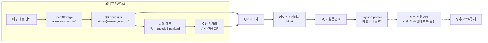

# Prepped

> 가족이나 사용자가 자주 먹는 메뉴를 미리 준비하고, 시니어는 하나의 QR로 키오스크 주문 단계를 줄이는 서비스

**키오스크를 잘 쓰게 만드는 것이 아니라, 키오스크를 잘 쓸 필요가 없게 만듭니다.**

Prepped는 키오스크 앞에서 메뉴를 처음부터 찾고 옵션을 고르는 부담을 줄이기 위해 시작했습니다. 자주 먹는 메뉴 조합을 모바일에서 미리 저장해 QR로 만들고, 키오스크에서는 QR을 읽어 선택 정보를 곧바로 불러옵니다.

이 저장소는 그 경험을 검증하는 **프런트엔드 MVP**입니다. 실제 POS 주문이나 결제 대신 모바일 메뉴 설정, QR 생성, 카메라 스캔과 메뉴 ID 해석까지 구현합니다.

## 왜 Prepped인가요?

키오스크 주문은 메뉴 탐색부터 옵션, 포장 여부, 결제까지 여러 단계를 요구합니다. 화면에 익숙하지 않은 사용자는 뒤에 사람이 기다리는 상황에서 더 큰 압박을 느낄 수 있습니다.

Prepped는 화면을 조금 더 쉽게 만드는 데서 멈추지 않습니다. **반복되는 메뉴 선택을 키오스크에 도착하기 전에 준비해 현장에서 거쳐야 할 단계를 줄이는 것**을 목표로 합니다.

## 이렇게 사용합니다

1. **메뉴 준비** — 가족이나 사용자가 모바일에서 매장, 카테고리, 자주 먹는 메뉴를 고릅니다.
2. **QR 생성·공유** — 저장한 매장별 메뉴 ID가 하나의 QR에 담기며 전체 또는 매장별 링크로 전달할 수 있습니다.
3. **키오스크 스캔** — 키오스크 카메라에 QR을 보여줍니다.
4. **주문 확인** — 키오스크가 매장과 메뉴 ID를 읽고 주문 확인 단계로 이동합니다.

현재 MVP의 마지막 단계는 QR 원문과 메뉴 ID를 보여주는 데모입니다. 메뉴의 판매 여부와 가격 검증, 실제 주문 생성과 결제는 향후 백엔드·POS 연동 범위입니다.

## 누구에게 어떤 가치가 있나요?

| 대상 | 기대 가치 |
|---|---|
| 시니어 사용자 | 복잡한 메뉴 탐색을 반복하지 않고 익숙한 조합을 빠르게 불러옵니다. |
| 가족 | 자주 먹는 메뉴를 미리 준비해 키오스크 사용 부담을 함께 줄일 수 있습니다. |
| 브랜드·키오스크 운영자 | 주문 도중 포기할 가능성이 있는 고객에게 더 짧은 주문 경로를 제공할 수 있습니다. |

## 현재 MVP에서 체험할 수 있는 것

| 경로 | 대상 화면 | 제공 기능 |
|---|---|---|
| `/` | 모바일 메뉴 QR PWA | 내 QR 보기, 전체·매장별 공유 링크 복사, 공유받은 읽기 전용 QR, 매장 → 카테고리 → 메뉴 선택, 선택 목록 저장, `내 설정`에서 저장 메뉴·합계 확인과 수정 |
| `/kiosk` | 노트북 키오스크 데모 | 카메라 QR 스캔, QR 원문과 매장·메뉴 ID 표시, 샘플 QR 흐름, 결제 완료 화면 데모 |

## 현재 MVP와 제품 비전

Prepped가 지향하는 경험은 **One Person → One QR → Multiple Brands**입니다. 다만 현재 코드가 제공하는 범위와 장기 비전은 다음처럼 구분됩니다.

| 영역 | 현재 MVP | 제품 비전 |
|---|---|---|
| 메뉴 설정 | 한 브라우저에서 mock 메뉴를 선택하고 기기 로컬에 저장 | 가족 계정과 원격 설정·변경 |
| QR | 메뉴 ID가 들어 있는 QR을 저장 내용에 맞춰 다시 생성 | 다시 발급하지 않아도 서버의 최신 설정을 불러오는 개인 QR 카드 |
| 브랜드 | 맥도날드 mock 메뉴 제공, 서브웨이는 준비 중 | 하나의 QR 규격으로 여러 브랜드 연결 |
| 키오스크 | QR 원문과 메뉴 ID 파싱, 결제 화면 데모 | POS 메뉴 검증, 실제 주문 생성과 결제 연동 |

## 아키텍처

현재 구조는 두 사용자 화면과 하나의 QR 계약으로 구성된 프런트엔드 MVP입니다. 모바일 PWA가 메뉴 ID를 저장·직렬화하고, 키오스크가 QR 원문을 읽어 매장과 메뉴 ID로 다시 나눕니다.



| 경계 | 현재 책임 |
|---|---|
| 모바일 PWA | mock 메뉴 선택, 매장별 저장 조합 관리, payload 직렬화, QR 이미지 생성과 전체·매장별 공유 링크 복사 |
| QR payload | 매장 키와 메뉴 ID만 전달하며 이름·가격·재고·결제 권한은 담지 않음 |
| 키오스크 | 카메라 프레임에서 QR 원문을 인식하고 매장 그룹과 메뉴 ID를 파싱해 표시 |
| 향후 백엔드 | 매장·메뉴 ID 유효성, 현재 가격, 재고, 판매 여부를 검증하고 주문 생성 |
| 향후 POS·결제 | 검증된 주문과 금액을 받아 결제 처리 |

현재는 키오스크 parser까지 브라우저에서 동작합니다. 점선으로 표시한 주문 API와 POS·결제는 아직 연결되지 않았습니다.

## QR 데이터 계약

한 매장은 `store={menuId,menuId}` 형식으로 직렬화하고 여러 매장은 세미콜론으로 구분합니다.

```text
mcdonald={101,201,301}
mcdonald={101,201};subway={401,402}
```

`전체 링크 복사`는 현재 QR의 모든 매장 그룹을, 매장 카드의 `공유`는 해당 매장 그룹만 `?qr=` query에 URL encoding해 복사합니다. 공유 링크를 연 기기에서는 링크의 QR을 읽기 전용으로 보여주며 기존 저장 메뉴를 바꾸지 않습니다.

백엔드 API가 확정되기 전까지 키오스크는 QR 문자열을 파싱해 매장 키와 메뉴 ID를 표시합니다. 메뉴 조합은 브라우저 `localStorage`에만 저장되며 서버 또는 다른 기기로 동기화되지 않습니다. 공유 링크는 메뉴 ID가 포함된 공개 가능한 전달 수단이며 비밀 토큰이 아닙니다.

- 현재 활성화된 저장 메뉴가 없으면 `menu={}`를 사용합니다.
- QR에는 가격이나 메뉴 이름을 넣지 않고 메뉴 ID만 전달합니다.
- 키오스크는 알 수 없는 매장 키도 버리지 않고 인식된 원문과 함께 표시합니다.
- 백엔드가 연결되면 QR의 ID를 신뢰하지 않고 서버가 매장 소속, 가격과 판매 상태를 다시 검증해야 합니다.

메뉴 조합은 브라우저 `localStorage`의 `onemeal-menu-v1`에만 저장됩니다. 공유 링크의 payload는 읽기 전용 상태로 분리되며 저장 메뉴를 덮어쓰지 않습니다. 현재는 사용자 계정, 서버 백업 또는 다른 기기와의 동기화를 제공하지 않습니다.

문법, parser와 후속 API 경계의 상세 기준은 [Prepped 기술 명세](docs/technical-specification.md)를 참고하세요.

## 기술 구성

| 영역 | 구성 |
|---|---|
| UI | React 19, TypeScript |
| 앱·빌드 | vinext 기반 Next.js 호환 라우팅, Vite |
| QR | `qrcode` 이미지 생성, `jsqr` 카메라 프레임 인식 |
| PWA | Web App Manifest, Service Worker, 브라우저 `localStorage` |
| 실행·배포 | Cloudflare Worker 진입점, OpenAI Sites 프로젝트 설정 |

## 프로젝트 구조

| 경로 | 역할 |
|---|---|
| `app/page.tsx` | 모바일 메뉴 선택, 로컬 저장과 QR 생성 화면 |
| `app/lib/qr-share.ts` | QR 공유 URL 검증·생성, 매장 그룹 추출과 Clipboard fallback 경계 |
| `app/kiosk/page.tsx` | 카메라 스캔, payload parser와 결제 데모 화면 |
| `app/globals.css` | 모바일·키오스크 공통 스타일과 반응형 UI |
| `public/manifest.webmanifest` | PWA 이름, 시작 경로와 표시 설정 |
| `public/sw.js` | 앱 셸과 정적 자산 캐시 |
| `worker/index.ts` | vinext 앱의 Cloudflare Worker 진입점 |
| `tests/rendered-html.test.mjs` | 모바일·키오스크 SSR과 PWA·QR 계약 회귀 검사 |
| `tests/qr-share.test.mjs` | 공유 URL 왕복·유효성·매장 추출·복사 fallback 단위 검사 |
| `docs/technical-specification.md` | 제품·QR·상태·API 경계의 공식 기술 명세 |
| `.openai/hosting.json` | OpenAI Sites 프로젝트 연결 설정 |

## 로컬 개발

요구 사항: Node.js `>=22.13.0`

```bash
npm install
npm run dev
```

개발 서버가 안내하는 주소에서 `/`와 `/kiosk`를 엽니다. 카메라 스캔은 브라우저 권한과 HTTPS 또는 localhost 같은 보안 컨텍스트가 필요합니다. 카메라가 없는 환경에서는 `/kiosk`의 샘플 QR 버튼으로 후속 흐름을 확인할 수 있습니다.

## 검증

```bash
npm run build
npm test
npm run lint
```

| 명령 | 확인 범위 |
|---|---|
| `npm run build` | `/`, `/kiosk`를 포함한 프로덕션 빌드 |
| `npm test` | 빌드 후 공유 URL 단위 검사와 모바일·키오스크 렌더링·PWA·QR 계약 회귀 검사 |
| `npm run lint` | TypeScript·React·접근성 관련 정적 검사 |

## 개인정보와 보안 경계

- 현재 MVP는 이름, 이메일, 결제 정보 같은 개인정보를 수집하거나 저장하지 않습니다.
- 메뉴 조합은 현재 브라우저에만 남으며 서버로 전송되지 않습니다.
- QR은 비밀 토큰이 아닙니다. 카메라로 볼 수 있는 누구나 매장 키와 메뉴 ID를 읽을 수 있습니다.
- 공유 링크도 비밀 토큰이 아니며 URL을 받은 누구나 매장 키와 메뉴 ID를 읽을 수 있습니다.
- 메뉴 ID는 주문 의사 표현일 뿐 가격, 재고 또는 결제 권한을 증명하지 않습니다.
- 실제 연동에서는 payload 길이, 허용 매장, 메뉴 ID 형식과 개수를 서버에서 다시 검증해야 합니다.

## 현재 제한 사항

- 선택 가능한 데이터는 맥도날드 mock 메뉴뿐이며 서브웨이는 준비 중 상태입니다.
- 백엔드, 사용자 계정, 서버 저장, 기기 간 동기화가 없습니다.
- 실제 POS 주문과 결제를 수행하지 않습니다. `/kiosk`의 결제 버튼은 사용자 흐름 데모입니다.
- QR 내용이 메뉴 변경과 함께 바뀌므로 제품 비전의 재발급 없는 개인 카드는 아직 구현되지 않았습니다.

프로젝트 운영은 [Hyper-Waterfall](https://github.com/postmelee/hyper-waterfall) v0.3.0 규칙을 따릅니다.
