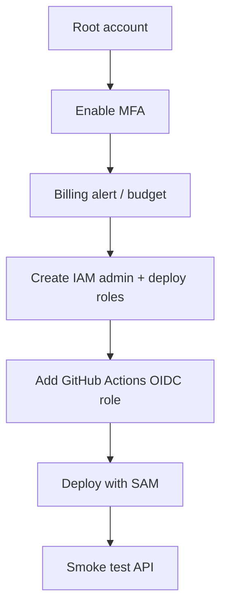

# AWS Deployment

## Current state

Current user-provided AWS readiness:

- root account is already prepared
- $25 promotional credit is available

That means AWS bootstrap can begin, but the account still needs proper IAM separation before any real deployment work.

## Account bootstrap order



## Required IAM setup

Do not use the root account for daily work.

Recommended setup:

- Root account: billing, recovery, and initial account ownership only
- IAM admin user or role: manual administration
- IAM deploy role: SAM/CloudFormation deployment
- GitHub Actions OIDC role: automated deployment

Recommended permissions scope:

- API Gateway HTTP API
- Lambda
- DynamoDB
- CloudWatch Logs
- IAM pass-role only where required for deployment

## Environment variables

The backend should be driven by environment variables rather than hard-coded values.

Expected variables:

- `ALLOWED_ORIGINS`
- `TABLE_NAME`
- `AWS_REGION`
- `STAGE`

## Local validation

Before the first deployment, run the project-local checks:

```bash
npm test --prefix backend
npm run build --prefix backend
sam validate --template backend/template.yaml
```

## Deployment flow

1. Build the backend.
2. Validate the SAM template.
3. Deploy to a development stack.
4. Confirm the API can create and fetch a draft.
5. Confirm CORS works from the approved frontend origin.
6. Record the actual deployed URL and stage in the document.

## Rollback flow

If deployment fails or the API shape is wrong:

1. Stop promoting the change.
2. Revert the last backend commit or redeploy the previous known-good stack.
3. Verify the last good version still serves the same token lookup route.
4. Keep the QR format stable until the frontend is ready.

## Budget and safety notes

- Set a budget alarm before repeated testing.
- Keep the first deployment small to stay within the current credit.
- Prefer short-lived dev stacks over long-running experimental resources.
- Delete temporary stacks after validation if they are no longer needed.

## OIDC setup checklist

The GitHub Actions deployment role should:

- trust the repository OIDC provider
- restrict the branch or workflow name
- allow deployment only to the intended stack
- avoid static AWS access keys

## Open questions

- Which AWS region should be the default development region?
- Which origin list should be used for ChatGPT Sites and localhost?
- Whether deployment should publish directly from `develop/backend` or from a release branch later

## Next step

Create the `backend/` project scaffold and wire the deployment parameters into the SAM template and CI workflow.
