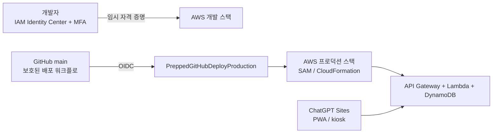

# Prepped AWS 배포·IAM 운영 계획

## 적용 범위

이 문서는 ChatGPT Sites 프론트엔드와 AWS 백엔드를 분리 배포하는 MVP 절차입니다. 백엔드 구현은 `develop/backend`에서 진행하고, 최종 통합·프로덕션 배포는 `main` 브랜치만 사용합니다.



## 계정 원칙

현재 AWS 계정은 루트 계정과 25달러 크레딧 토큰을 보유한 상태입니다. 크레딧 코드는 결제·계정 정보이므로 저장소, Issue, PR, CI 비밀값, 채팅에 기록하거나 공유하지 않습니다. 계정 소유자가 AWS Billing 콘솔에서 직접 적용 여부와 잔액을 확인합니다.

루트 사용자는 다음 초기 설정에만 사용합니다.

1. 루트 사용자에 강력한 비밀번호와 MFA를 설정합니다. 가능한 경우 피싱 저항성이 있는 패스키 또는 보안 키를 우선합니다.
2. 루트 액세스 키가 있으면 사용하지 않고, 새 액세스 키는 만들지 않습니다.
3. 결제 연락처와 계정 복구 수단을 팀이 관리 가능한 방식으로 확인합니다.
4. IAM Identity Center를 활성화하고 첫 관리자 사용자를 만듭니다.
5. AWS Budgets와 비용 이상 감지를 설정합니다.

AWS는 일상 작업에 루트 사용자를 쓰지 말고 관리자를 별도로 만들며, 루트 액세스 키를 만들지 말 것을 권장합니다. [루트 사용자 보안 모범 사례](https://docs.aws.amazon.com/IAM/latest/UserGuide/root-user-best-practices.html)와 [AWS 계정 관리자 보안 지침](https://docs.aws.amazon.com/signin/latest/userguide/best-practices-admin.html)을 따릅니다.

## IAM Identity Center: 사람의 접근

IAM 사용자별 장기 액세스 키 대신 IAM Identity Center의 사용자·그룹·Permission Set을 사용합니다. IAM Identity Center는 MFA를 기본 설정으로 제공합니다. [AWS MFA 안내](https://docs.aws.amazon.com/IAM/latest/UserGuide/gs-identities-mfa.html)

### 초기 구성

| 순서 | 콘솔 작업 | 결과 |
|---|---|---|
| 1 | IAM Identity Center 활성화 | AWS 액세스 포털 생성 |
| 2 | `prepped-admins`, `prepped-developers` 그룹 생성 | 팀별 권한 분리 |
| 3 | 팀원 개인 사용자 초대 및 MFA 등록 | 공유 계정 금지 |
| 4 | `PreppedAdminBootstrap` Permission Set을 관리자 1~2명에게만 임시 할당 | 최초 인프라 구성 |
| 5 | `PreppedDeveloper` Permission Set을 개발자에게 할당 | 개발 스택 배포·로그 조회 |
| 6 | 최초 구성이 끝나면 `PreppedAdminBootstrap`을 제거하거나 최소 권한으로 축소 | 상시 관리자 권한 축소 |

개발자는 `aws configure sso` 또는 AWS 액세스 포털을 통해 임시 자격 증명으로만 CLI를 사용합니다. `.aws/credentials`, `AWS_ACCESS_KEY_ID`, `AWS_SECRET_ACCESS_KEY`를 프로젝트 파일·GitHub Secret에 보관하지 않습니다.

### Permission Set 최소 권한 기준

| 주체 | 허용 범위 | 명시 금지 |
|---|---|---|
| `PreppedAdminBootstrap` | IAM Identity Center, OIDC Provider, 배포 역할·CloudFormation 실행 역할 생성, Budgets 설정 | 일상 개발·루트 사용자 공유 |
| `PreppedDeveloper` | `prepped-dev-*` API Gateway·Lambda·DynamoDB·CloudWatch·SAM 아티팩트 S3, CloudFormation 스택 조회·변경 | 프로덕션 스택 변경, 다른 프로젝트 IAM 역할 `PassRole` |
| Lambda 실행 역할 | Prepped DynamoDB 테이블의 필요한 읽기·쓰기, CloudWatch Logs | IAM·결제·다른 테이블 접근 |
| GitHub 배포 역할 | `main`에서 CloudFormation 배포 역할을 경유한 프로덕션 배포 | IAM 전역 관리자, 장기 액세스 키 생성 |

처음에는 AWS 관리형 정책으로 빠르게 부트스트랩할 수 있지만, 실제 사용 행동을 확인한 뒤 IAM Access Analyzer로 필요한 권한만 남깁니다. 최소 권한과 임시 자격 증명은 [AWS IAM 보안 모범 사례](https://docs.aws.amazon.com/IAM/latest/UserGuide/best-practices.html)를 따릅니다.

## GitHub Actions OIDC: CI/CD 접근

AWS 장기 액세스 키를 GitHub Secrets에 저장하지 않습니다. GitHub Actions가 OIDC 토큰으로 AWS STS의 임시 자격 증명을 받아 `main` 브랜치에서만 프로덕션 배포하도록 구성합니다. AWS SAM은 GitHub Actions OIDC 기반 파이프라인을 지원합니다. [AWS SAM OIDC 파이프라인 안내](https://docs.aws.amazon.com/serverless-application-model/latest/developerguide/deploying-with-oidc.html)

### GitHub 설정

1. 저장소 Settings → Environments에서 `production` 환경을 만듭니다.
2. 배포 가능 브랜치를 `main`으로 제한하고, 필요하면 팀 리더 1명의 승인 규칙을 추가합니다.
3. `.github/workflows/backend-deploy.yml`은 `main` push 또는 `workflow_dispatch`만 허용합니다. `develop/backend`는 배포하지 않고 CI 검증만 수행합니다.
4. 워크플로 job에 `permissions: id-token: write`, `contents: read`만 부여합니다.

### AWS OIDC Provider와 신뢰 정책

IAM에 OIDC Provider `https://token.actions.githubusercontent.com`를 추가하고 Audience는 `sts.amazonaws.com`으로 설정합니다. 그 뒤 `PreppedGitHubDeployProduction` 역할의 신뢰 정책을 특정 저장소와 GitHub `production` Environment로 제한합니다. 아래 `{GITHUB_OIDC_SUBJECT}`에는 실제 workflow가 발급하는 `sub` 값을 정확히 넣습니다. 기존 형식은 `repo:postmelee/Prepped:environment:production`이지만, GitHub 조직·저장소 ID가 포함된 새 형식이 적용된 계정은 GitHub가 표시한 값으로 바꿉니다. 와일드카드를 사용하지 않습니다.

```json
{
  "Version": "2012-10-17",
  "Statement": [
    {
      "Effect": "Allow",
      "Principal": {
        "Federated": "arn:aws:iam::{AWS_ACCOUNT_ID}:oidc-provider/token.actions.githubusercontent.com"
      },
      "Action": "sts:AssumeRoleWithWebIdentity",
      "Condition": {
        "StringEquals": {
          "token.actions.githubusercontent.com:aud": "sts.amazonaws.com",
          "token.actions.githubusercontent.com:sub": "{GITHUB_OIDC_SUBJECT}"
        }
      }
    }
  ]
}
```

GitHub Environment를 OIDC subject 조건에 사용하면 `sub` 형식이 Environment 기반으로 바뀝니다. AWS 신뢰 정책과 GitHub Environment의 `main` 배포 브랜치 제한을 함께 적용하고, 브랜치 기반 subject와 혼용하지 않습니다.

AWS는 GitHub OIDC 역할에 `token.actions.githubusercontent.com:sub` 조건을 두고 특정 저장소·브랜치로 범위를 제한할 것을 권장합니다. [AWS GitHub OIDC 역할 구성](https://docs.aws.amazon.com/IAM/latest/UserGuide/id_roles_create_for-idp_oidc.html)과 [GitHub의 AWS OIDC 안내](https://docs.github.com/en/actions/how-tos/secure-your-work/security-harden-deployments/oidc-in-aws)를 참조합니다.

### 계정 부트스트랩 템플릿

[`backend/infra/github-oidc-bootstrap.yaml`](../backend/infra/github-oidc-bootstrap.yaml)은 GitHub OIDC Provider, `PreppedGitHubDeployProduction` 역할, `PreppedCloudFormationExecution` 역할을 별도 CloudFormation 스택으로 만듭니다. GitHub 역할은 `production` Environment subject 두 가지 형식만 허용하고, CloudFormation 실행 역할은 `prepped-*-order-api` Lambda·주문 테이블과 `prepped-*-catalog` 카탈로그 테이블, 로그 그룹·HTTP API 및 지정한 아티팩트 버킷으로 권한을 제한합니다. 배포 역할에는 카탈로그 데이터 쓰기 권한을 주지 않습니다.

계정 부트스트랩 관리자는 IAM Identity Center 임시 자격 증명으로 아래 명령을 실행합니다. 현재 해커톤 계정의 버킷명은 `prepped-prod-sam-artifacts-845081398362`입니다.

```bash
aws cloudformation deploy \
  --region ap-northeast-2 \
  --stack-name prepped-github-oidc-bootstrap \
  --template-file backend/infra/github-oidc-bootstrap.yaml \
  --capabilities CAPABILITY_NAMED_IAM
```

생성 후 CloudFormation 출력의 역할 ARN을 GitHub Environment 변수에 등록합니다. 사용자 장기 액세스 키를 GitHub에 등록하는 방식은 사용하지 않습니다.

## AWS 리소스와 환경 변수

기본 리전은 사용자와 가까운 `ap-northeast-2`(서울)로 통일합니다. 리전 변경은 스택 이름·CORS Origin·API URL과 함께 검토합니다.

| 변수 | 예시 | 관리 위치 | 비밀 여부 |
|---|---|---|---|
| `PREPPED_STAGE` | `dev`, `prod` | SAM Parameter | 아니오 |
| `PREPPED_ALLOWED_ORIGINS` | `https://{site}.chatgpt.site,http://localhost:3000` | SAM Parameter | 아니오 |
| `PREPPED_QR_BASE_URL` | `https://{site}.chatgpt.site` | SAM Parameter | 아니오 |
| `CATALOG_TABLE_NAME` | `prepped-dev-catalog` | SAM이 Lambda에 주입, CloudFormation Output | 아니오 |
| `DRAFT_TTL_DAYS` | `30` | SAM Parameter | 아니오 |
| `PREPPED_API_BASE_URL` | `https://{api-id}.execute-api.ap-northeast-2.amazonaws.com` | Sites Worker 환경 변수 | 아니오 |
| `LOG_LEVEL` | `info` | SAM Parameter | 아니오 |
| AWS 계정 ID·역할 ARN | 배포 환경 참조 | GitHub Environment 변수 | 비밀 아님 |

MVP에는 별도 애플리케이션 비밀이 없습니다. 결제·사용자 인증·외부 API 키가 생기는 후속 작업에서만 AWS Secrets Manager 또는 Parameter Store SecureString을 도입합니다.

### GitHub `production` Environment 변수

`backend-deploy.yml`은 아래 값을 GitHub Environment **Variables**에서만 읽습니다. 값은 비밀이 아니며, AWS 장기 액세스 키는 어떤 변수·Secret에도 넣지 않습니다.

| 변수 | 예시 | 용도 |
|---|---|---|
| `AWS_REGION` | `ap-northeast-2` | 배포 리전 |
| `AWS_ACCOUNT_ID` | `123456789012` | 잘못된 계정 배포 차단 |
| `AWS_DEPLOY_ROLE_ARN` | `arn:aws:iam::...:role/PreppedGitHubDeployProduction` | OIDC로 가정할 역할 |
| `CLOUDFORMATION_EXECUTION_ROLE_ARN` | `arn:aws:iam::...:role/PreppedCloudFormationExecution` | CloudFormation이 자원을 만들 때 쓰는 역할 |
| `SAM_ARTIFACT_BUCKET` | `prepped-prod-sam-artifacts-{account}` | SAM 패키지 아티팩트 전용 S3 버킷 |
| `ALLOWED_ORIGINS` | `https://{site}.chatgpt.site` | API Gateway와 Lambda CORS 허용 Origin 목록 |
| `QR_BASE_URL` | `https://{site}.chatgpt.site` | QR의 `/kiosk?draft={token}` 기본 URL |
| `DRAFT_TTL_DAYS` | `30` | 초안 TTL |
| `SMOKE_TEST_ORIGIN` | `https://{site}.chatgpt.site` | 배포 후 CORS 스모크 테스트에 사용할 단일 Origin |

`SAM_ARTIFACT_BUCKET`은 부트스트랩 관리자가 미리 만들고, Block Public Access·기본 암호화·필요한 수명 주기 정책을 적용합니다. GitHub 배포 역할에는 이 버킷과 `prepped-prod-order-api` 스택, 지정한 CloudFormation 실행 역할에 필요한 최소 권한만 부여합니다. CloudFormation 실행 역할은 이 SAM 템플릿이 만드는 Lambda, API Gateway, DynamoDB, CloudWatch Logs 및 Lambda 실행 역할만 생성·변경하도록 시작하고, 첫 배포 뒤 CloudTrail과 IAM Access Analyzer를 근거로 더 축소합니다.

현재 AWS 계정에서 확인된 고정 값은 아래와 같습니다. Sites URL은 배포 후 실제 값을 넣기 전까지 확정하지 않습니다.

| 변수 | 현재 값 |
|---|---|
| `AWS_REGION` | `ap-northeast-2` |
| `AWS_ACCOUNT_ID` | `845081398362` |
| `AWS_DEPLOY_ROLE_ARN` | `arn:aws:iam::845081398362:role/PreppedGitHubDeployProduction` |
| `CLOUDFORMATION_EXECUTION_ROLE_ARN` | `arn:aws:iam::845081398362:role/PreppedCloudFormationExecution` |
| `SAM_ARTIFACT_BUCKET` | `prepped-prod-sam-artifacts-845081398362` |
| `DRAFT_TTL_DAYS` | `30` |

## 배포 흐름

### 개발 환경

1. 개발자는 IAM Identity Center로 로그인해 임시 자격 증명을 받습니다.
2. `develop/backend`에서 프론트·백엔드 테스트, `npm --prefix backend run catalog:check`, dry-run 시드를 실행합니다.
3. 팀 승인 후 `prepped-dev-order-api` 스택을 배포합니다.
4. 스택 출력의 `CatalogTableName`을 확인하고 명시적으로 카탈로그를 시드합니다.
5. 카탈로그 조회·해석과 주문 생성·조회·완료를 스모크 테스트합니다.
6. 실제 Sites Origin preflight를 확인하고 Sites Worker의 `PREPPED_API_BASE_URL`을 `ApiBaseUrl` 출력으로 설정합니다.

```bash
npm --prefix backend run catalog:check
npm --prefix backend run catalog:seed:dry

CATALOG_TABLE_NAME="$(aws cloudformation describe-stacks \
  --stack-name prepped-dev-order-api \
  --query "Stacks[0].Outputs[?OutputKey=='CatalogTableName'].OutputValue" \
  --output text)"

CATALOG_TABLE_NAME="$CATALOG_TABLE_NAME" node backend/scripts/seed-catalog.mjs --apply
```

`--apply`는 같은 키의 1,022개 projection을 덮어쓰므로 대상 스택·테이블 이름과 `catalog:seed:dry` 결과를 운영자가 확인한 뒤 실행합니다. 수집기는 배포 런타임에서 실행하지 않습니다. 스냅샷을 갱신할 때는 `node backend/scripts/collect-catalog.mjs --live --check` 결과와 공식 출처 diff를 먼저 검토합니다.

카탈로그 스모크 테스트는 다음 경계를 확인합니다.

```bash
curl "$API_BASE_URL/v1/stores"
curl "$API_BASE_URL/v1/stores/mcdonald/menus?limit=1"
curl -X POST "$API_BASE_URL/v1/catalog/resolve" \
  -H 'content-type: application/json' \
  -d '{"storeId":"mcdonald","menuIds":["mcdonald-178","missing-menu"]}'
```

### 프로덕션 환경

1. `develop/backend` 변경을 `main` 대상 PR로 생성합니다.
2. `Backend CI`가 테스트·TypeScript 빌드·SAM 린트를 통과하고, 코드·API 명세·SAM 변경·비용 영향·CORS Origin을 검토합니다.
3. `main` 병합 후 `Deploy Backend to AWS`가 `production` Environment 승인과 OIDC 역할 가정을 기다립니다.
4. 워크플로가 다시 테스트·SAM 검증을 실행한 뒤 전용 S3 버킷으로 패키징하고 CloudFormation 실행 역할을 통해 `prepped-prod-order-api`를 배포합니다.
5. 배포 후 `GET /v1/health`, 초안 생성·조회·완료, 멱등 재시도, QR 재사용, CORS를 자동 스모크 테스트합니다. 토큰이나 주문 내용은 로그에 출력하지 않습니다.
6. 카탈로그 버전을 변경한 배포는 프로덕션 운영자가 `CatalogTableName` 출력과 dry-run을 확인하고 위와 같은 명시적 `--apply` 시드를 실행합니다. 이 단계는 자동 배포 역할에 데이터 쓰기 권한을 주지 않기 위해 자동화하지 않습니다.
7. 세 매장·대표 메뉴·부분 성공 resolve를 확인한 뒤 Sites Worker의 `PREPPED_API_BASE_URL`이 현재 `ApiBaseUrl`을 가리키는지 검증합니다.
8. CloudWatch 오류·지연과 AWS Budgets 알림을 확인합니다.

SAM으로 GitHub Actions 배포를 구성하는 기본 흐름은 [AWS SAM GitHub Actions 배포 문서](https://docs.aws.amazon.com/serverless-application-model/latest/developerguide/deploying-using-github.html)를 참조합니다. 이 프로젝트는 장기 액세스 키 예시 대신 앞 절의 OIDC 자격 증명을 사용합니다.

## 비용 가드레일

25달러 크레딧은 실습·MVP 비용을 위한 한도이지 무제한 예산이 아닙니다. 토큰의 잔액·만료·적용 서비스는 Billing 콘솔에서 계정 소유자가 확인합니다.

- AWS Budgets에 월간 실제 비용 알림을 **10달러, 18달러, 22달러**로 설정합니다.
- Cost Anomaly Detection을 활성화하고 알림 수신자를 팀 운영 이메일로 지정합니다.
- DynamoDB는 온디맨드 모드, Lambda는 필요한 최소 메모리·타임아웃, CloudWatch 로그는 짧은 보존 기간으로 시작합니다.
- 데모 종료 후 `sam delete`로 개발 스택을 정리합니다. 데이터 보존이 필요한 데모 스택은 삭제 전에 승인합니다.
- NAT Gateway, 상시 EC2, RDS, 과도한 WAF 규칙은 MVP에 도입하지 않습니다. 필요성이 생기면 비용 검토 이슈를 별도로 만듭니다.

## 롤백과 장애 대응

| 상황 | 조치 |
|---|---|
| API 코드 오류 | GitHub에서 직전 정상 `main` 커밋을 revert하고 OIDC 배포 재실행 |
| CloudFormation 배포 실패 | 스택 이벤트를 확인하고 변경 세트를 취소 또는 실패 변경을 revert |
| CORS 오류 | 허용 Origin Parameter와 실제 ChatGPT Sites Origin을 비교 후 수정·재배포 |
| DynamoDB 데이터 오류 | 초안·완료 기록을 무단 삭제하지 않고 문제 토큰·requestId를 확인한 뒤 복구 이슈 생성 |
| 카탈로그 시드 오류 | `CatalogTableName`과 스냅샷 버전을 다시 확인하고 같은 검증된 시드를 재실행; 임의 삭제·부분 수정 금지 |
| 비용 급증 | Budgets 알림 확인, 개발 스택 배포 중지, 필요 시 `sam delete` 승인 요청 |

프로덕션의 데이터 삭제, 스택 삭제, 권한 확장, 결제 설정 변경은 별도 명시 승인이 필요합니다.

## 배포 전 체크리스트

- [ ] 루트 MFA 설정, 루트 액세스 키 없음
- [ ] IAM Identity Center 관리자·개발자 개인 계정과 MFA 설정
- [ ] 개발·프로덕션 역할이 최소 권한이고 `PassRole` 범위가 제한됨
- [ ] GitHub OIDC Provider와 `postmelee/Prepped`의 `main` 조건 설정
- [ ] GitHub `production` Environment가 `main`만 허용
- [ ] `production` Environment 변수 9개와 전용 SAM 아티팩트 버킷 설정
- [ ] OIDC 배포 역할과 CloudFormation 실행 역할을 분리하고 `iam:PassRole` 범위를 실행 역할 하나로 제한
- [ ] CORS Origin이 실제 ChatGPT Sites URL과 로컬 개발 URL로 제한됨
- [ ] 10·18·22달러 Budgets 알림 및 이상 비용 알림 설정
- [ ] `sam validate`, 백엔드 테스트, 개발 스택 스모크 테스트 통과
- [ ] 카탈로그 수집 검증·dry-run, 대상 `CatalogTableName`, 3개 매장·대표 메뉴·resolve 스모크 확인
- [ ] Sites Worker `PREPPED_API_BASE_URL`이 현재 API Gateway 출력과 일치
- [ ] 프로덕션 배포 및 롤백 담당자 확인
