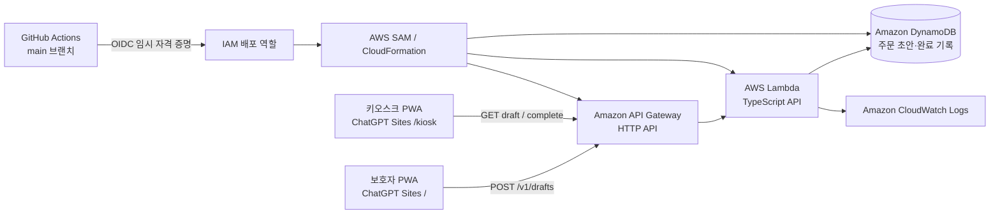

# Prepped 백엔드 아키텍처

## 목적과 경계

Prepped는 보호자가 메뉴 조합을 미리 고르고 QR로 전달하면, 키오스크가 QR을 스캔해 주문을 복원하는 서비스입니다. 프론트엔드는 ChatGPT Sites의 React PWA(`/`)와 키오스크 화면(`/kiosk`)으로 호스팅하고, 주문 초안과 완료 기록은 AWS 백엔드가 보관합니다.

이 문서는 MVP의 서버 경계와 보안 결정을 정의합니다. 실제 PG 결제, POS 연동, 로그인, 카드·개인정보 저장은 이 구조에 포함하지 않습니다.

## 현재 상태와 전환 원칙

현재 프론트엔드는 `localStorage`와 `mcdonald={101,201,301}` 형식의 QR 원문을 사용합니다. 이 형식은 기존 데모와 호환되므로 즉시 제거하지 않습니다.

새 주문 초안 QR은 아래처럼 키오스크 웹앱 URL과 난수 토큰만 포함합니다. 메뉴명, 옵션, 금액, 이름, 전화번호, 결제 정보는 QR 본문에 절대 포함하지 않습니다.

```text
https://{KIOSK_WEB_BASE_URL}/kiosk?draft={opaque-token}
```

키오스크는 이 URL의 `draft` 쿼리에서 토큰을 추출해 백엔드에서 주문 초안을 조회합니다. 레거시 메뉴 원문 QR을 받으면 기존 파서로 처리하고, 토큰 QR을 받으면 API 조회 흐름으로 처리합니다. 이 병행 기간이 끝나기 전에는 기존 QR 문법을 바꾸지 않습니다.

## 대상 구조



API Gateway HTTP API는 Lambda 통합, 명시적 CORS, 자동 배포를 지원하므로 MVP의 공개 HTTPS API에 사용합니다. AWS는 HTTP API가 Lambda 백엔드와 통합될 수 있으며 CORS를 기본 지원한다고 안내합니다. [AWS HTTP API 문서](https://docs.aws.amazon.com/apigateway/latest/developerguide/http-api.html)

## 구성 요소와 책임

| 구성 요소 | 책임 | 보관하거나 처리하지 않는 정보 |
|---|---|---|
| ChatGPT Sites PWA | 메뉴·옵션 선택, API 호출, QR 이미지 생성·표시 | AWS 자격 증명, 결제 정보 |
| API Gateway HTTP API | HTTPS 경로 라우팅, CORS preflight, 요청 크기·속도 제한 | 주문 영속 데이터 |
| Lambda | 요청 검증, 서버 카탈로그 가격 계산, 토큰 발급, 초안·완료 기록 처리 | 장기 사용자 세션, 결제 수단 |
| DynamoDB | 주문 초안 스냅샷과 완료 주문 기록 영속화 | 사용자 계정·카드·연락처 |
| CloudWatch Logs | 오류·지연 시간·요청 ID 관찰 | QR 전체값, 개인정보, 결제 정보 |
| GitHub Actions + OIDC | `main` 병합 후 SAM 배포 | 장기 AWS 액세스 키 |

## 요청 흐름

### 1. 주문 초안 생성

1. 보호자 화면은 매장 ID, 메뉴 ID, 옵션 ID, 수량만 전송합니다.
2. Lambda는 서버 카탈로그로 매장·메뉴·옵션을 검증하고 가격·합계를 계산합니다.
3. Lambda는 암호학적으로 안전한 256비트 난수 토큰을 만들고, 메뉴·옵션·가격 스냅샷을 DynamoDB에 저장합니다.
4. 응답의 `qrPayload`를 PWA가 QR 이미지로 변환합니다.

### 2. 키오스크 주문 복원

1. 키오스크 카메라가 QR을 읽고 `draft` 토큰을 추출합니다.
2. 키오스크는 `GET /v1/drafts/{token}`으로 초안 스냅샷을 조회합니다.
3. 큰 글씨의 매장·메뉴·옵션·수량·합계를 표시하고, 어르신이 최종 확인합니다.
4. 조회는 초안을 수정하지 않으므로 같은 QR을 다시 사용할 수 있습니다.

### 3. 데모 결제 완료

1. 키오스크는 UUID 형식의 `Idempotency-Key`와 함께 완료 API를 호출합니다.
2. Lambda는 초안을 그대로 유지하고, 별도 완료 주문 레코드만 생성합니다.
3. 같은 멱등 키로 재시도하면 기존 완료 결과를 반환합니다. 네트워크 재시도로 주문 기록이 중복 생성되는 것을 막습니다.

## 데이터 모델

MVP는 DynamoDB 단일 테이블을 사용합니다. 초안 조회는 토큰 하나로 `GetItem` 할 수 있고, 주문 기록은 초안과 분리돼 QR 재사용성을 보장합니다.

| 레코드 | 파티션 키 / 정렬 키 | 주요 속성 | 수명 |
|---|---|---|---|
| 주문 초안 | `DRAFT#{token}` / `META` | 매장, 메뉴·옵션 스냅샷, 합계, 생성 시각, 만료 시각 | 기본 30일, DynamoDB TTL로 정리 |
| 완료 멱등 결과 | `DRAFT#{token}` / `COMPLETE#{idempotencyKey}` | 주문 ID, 완료 시각, 응답 스냅샷 | 초안과 같은 TTL |
| 주문 기록 | `ORDER#{orderId}` / `META` | 초안 토큰 참조, 주문 스냅샷, 데모 결제 상태, 확인 시각 | MVP에서는 보존 |

초안의 가격·옵션은 생성 당시의 스냅샷으로 저장합니다. 이후 카탈로그 가격이 바뀌어도 이미 발급된 QR의 주문 화면과 합계가 바뀌지 않습니다. 30일은 MVP 기본값이며 `DRAFT_TTL_DAYS` 환경 변수로 조정합니다. 삭제·만료된 초안은 `404 DRAFT_NOT_FOUND`로만 응답해 존재 여부를 불필요하게 노출하지 않습니다.

## API와 도메인 규칙

| 경로 | 용도 | 핵심 규칙 |
|---|---|---|
| `GET /v1/health` | 배포·운영 상태 확인 | 데이터·비밀 정보 미반환 |
| `POST /v1/drafts` | 보호자 주문 초안 생성 | 서버 카탈로그로 가격 계산, 토큰 발급 |
| `GET /v1/drafts/{token}` | 키오스크 주문 복원 | 읽기 전용, QR 재사용 가능 |
| `POST /v1/drafts/{token}/complete` | 데모 결제 완료 기록 | `Idempotency-Key` 필수, 초안은 유지 |

정확한 요청·응답·오류 형식은 [API 명세](api-specification.md)를 기준으로 합니다.

## 보안 설계

- **토큰은 권한 증표입니다.** 256비트 난수로 생성하고, 추측·순차 값·주문 정보 인코딩을 금지합니다. 로그에는 토큰 원문 대신 요청 ID와 토큰 해시 앞부분만 남깁니다.
- **가격 신뢰 경계는 서버입니다.** 클라이언트가 보낸 `price`, `total`, 메뉴명은 무시하고 서버 카탈로그에서 재계산합니다.
- **CORS는 명시적 Origin만 허용합니다.** ChatGPT Sites 실제 URL과 개발용 `http://localhost`만 환경별 목록으로 설정하며 `*`를 사용하지 않습니다.
- **공개 API 보호를 최소로 시작합니다.** API Gateway의 요청 제한, 본문 크기 제한, 구조화된 입력 검증을 적용합니다. 비정상 트래픽이 확인되면 AWS WAF·추가 rate limit을 별도 작업으로 도입합니다.
- **AWS 자격 증명은 임시 자격 증명만 사용합니다.** 사람은 IAM Identity Center, CI는 GitHub OIDC 역할을 사용합니다. IAM 모범 사례는 임시 자격 증명과 최소 권한을 권장합니다. [AWS IAM 보안 모범 사례](https://docs.aws.amazon.com/IAM/latest/UserGuide/best-practices.html)

## 관찰성·오류 처리

- Lambda CloudWatch 로그는 7일간 보관하고, X-Ray 추적은 AWS 기본 30일 보존 기간을 따릅니다. 토큰·주문 본문·개인정보는 애플리케이션 로그에 기록하지 않습니다.
- `5xx` 오류, Lambda 오류, API Gateway 4xx/5xx, DynamoDB 처리량·오류를 CloudWatch에서 관찰합니다.
- 사용자에게는 재시도 가능한 오류인지 알 수 있는 코드와 짧은 한국어 안내를 반환합니다. 예: `NETWORK_RETRY`, `DRAFT_NOT_FOUND`, `VALIDATION_ERROR`.
- 주문 초안은 조회 실패와 결제 완료 실패를 분리해 표시합니다. 완료 요청이 시간 초과되면 동일 `Idempotency-Key`로 재시도합니다.

## 환경과 브랜치

| 구분 | 소유·배포 방식 | 용도 |
|---|---|---|
| 로컬 | 개발자 IAM Identity Center 임시 자격 증명 | API·테스트·SAM 검증 |
| AWS 개발 | 수동 승인된 SAM 배포 | 프론트엔드 연동·스모크 테스트 |
| AWS 프로덕션 | `main`의 GitHub Actions OIDC | 최종 데모·배포 |

백엔드 구현은 `develop/backend`에서 진행하고, 최종 통합·배포 PR은 `main`을 대상으로 합니다. 팀원의 `devel` 변경은 출시 전에 최신 상태를 반영하되, 다른 작업의 커밋을 강제 변경하지 않습니다.

## 구현 파일 구조

```text
backend/
  src/
    handlers/        # HTTP 경로별 Lambda 핸들러
    domain/          # 카탈로그, 초안, 완료 주문 도메인 규칙
    repositories/    # DynamoDB 접근 경계
    http/            # 입력 검증, 오류·CORS 응답
  tests/             # 단위·통합 테스트
  template.yaml      # SAM / CloudFormation 인프라
  package.json
docs/
  backend-architecture.md
  api-specification.md
  aws-deployment.md
```

다음 단계에서는 이 구조와 API 명세를 그대로 구현하고, 문서와 코드가 어긋나면 API 명세를 먼저 갱신한 뒤 검토합니다.
