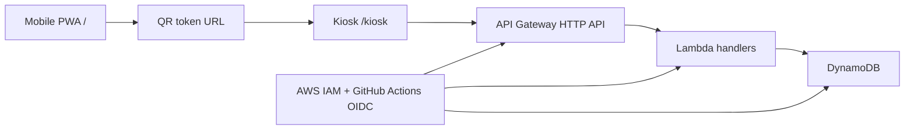

# Backend Architecture

## Current status

This repository still runs as a mobile QR PWA plus kiosk scanner starter. There is no committed `backend/` service yet, and the current backend-related runtime is only the template worker shell from the starter.

The current front-end behavior is intentionally local-first:

- `/` is the mobile QR creator.
- `/kiosk` is the camera-based scanner.
- QR state is stored in browser storage.
- The kiosk currently parses the QR payload directly instead of calling a server.

The backend task is therefore a new integration layer, not a refactor of an already existing API.

## Architecture goal

We want a small AWS serverless API that stores a draft order behind a random token and lets the kiosk resolve the draft from that token.

## Core constraints

- Keep the existing QR/menu parsing contract stable until the new token flow is fully ready.
- Do not place personal data, payment data, or card data in the QR payload.
- Use explicit allowed origins for CORS.
- Keep the deployment path reproducible across environments.
- Use IAM roles, not long-lived root credentials, for day-to-day work.

## Proposed runtime split

| Layer | Responsibility | Notes |
|---|---|---|
| Front-end PWA | Build menu state and render QR | Still browser storage first |
| Kiosk UI | Scan QR and show order details | Supports the current parsing flow during transition |
| API Gateway HTTP API | Public entry point | Versioned JSON contract |
| Lambda | Draft storage and lookup | Small handlers, no heavy framework assumptions |
| DynamoDB | Draft/order persistence | Token-indexed records |
| IAM | Access control | Root account reserved for bootstrap only |

## Data shape

The backend draft should be minimal and durable:

- token
- store identifier
- selected menu IDs
- draft status
- timestamps
- optional completion metadata

The completed order record should be separate from the draft record so the same token can still resolve the original draft while the order history remains append-only.

## QR contract note

The current UI still emits and accepts a store-prefixed payload in local mode. The implementation plan keeps that behavior alive during transition so that the kiosk can continue to work while the token-based backend is being introduced.

The new backend contract should therefore be treated as an additive path first, then a migration target later.

## IAM and account setup

Current AWS state from the user:

- root account is prepared
- $25 promotional credit is available

That is enough to start, but not enough to operate safely.

Recommended next step:

1. Enable MFA on the root account.
2. Keep the root account for billing, support, and account recovery only.
3. Create an IAM admin or deployment role for actual work.
4. Create a separate GitHub Actions OIDC role for CI/CD.
5. Attach least-privilege permissions for Lambda, API Gateway, DynamoDB, CloudWatch, and SAM deployment.
6. Add a budget alert before any repeat deployment.

## Open questions

- Which exact allowed origins should be whitelisted for ChatGPT Sites and local development?
- Which QR format should become the long-term canonical one after the migration window?
- Whether the first release should store only drafts or also completed orders from the start.

## Next implementation step

Create the `backend/` scaffold with handlers, storage abstraction, and contract tests that match this architecture.
