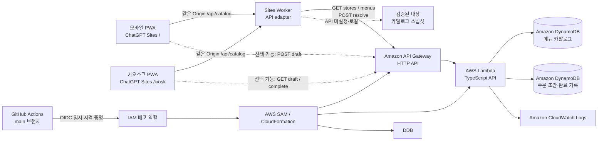

# Prepped 백엔드 아키텍처

## 목적과 경계

Prepped는 사용자가 메뉴 조합을 미리 고르고 QR로 전달하면, 키오스크가 QR을 스캔해 선택 매장의 주문 목록을 복원하는 서비스입니다. 프론트엔드는 ChatGPT Sites의 React PWA(`/`)와 키오스크 화면(`/kiosk`)으로 호스팅하고, 실제 메뉴 카탈로그와 선택적 주문 초안·완료 기록은 AWS 백엔드가 보관합니다.

이 문서는 MVP의 서버 경계와 보안 결정을 정의합니다. 실제 PG 결제, POS 연동, 로그인, 카드·개인정보 저장은 이 구조에 포함하지 않습니다.

## 현재 상태와 전환 원칙

현재 프론트엔드는 카탈로그 버전 `2026-08-16.1`의 495개 실제 메뉴를 조회하고, 매장별 메뉴 ID를 기기 `localStorage`에 저장합니다. 새 설정은 `prepped-menu-settings-v2`에 보관하며 기존 `onemeal-menu-v1` 값은 읽을 때 알려진 숫자형 맥도날드 ID를 이관합니다.

Task #7의 기본 QR은 기존 원문 계약을 그대로 확장해 여러 매장을 세미콜론으로 구분합니다. 메뉴명, 옵션 객체, 금액, 이름, 전화번호, 결제 정보는 QR 본문에 포함하지 않습니다.

```text
mcdonald={mcdonald-178,mcdonald-720};subway={subway-1530-15cm};starbucks={starbucks-94}
```

키오스크는 사용자가 먼저 선택한 매장 그룹만 추출해 카탈로그 일괄 해석 API를 호출합니다. Issue #3의 주문 초안 URL QR은 별도 백엔드 기능으로 유지하지만, 프론트 통합이 승인되기 전까지 기본 QR로 전환하지 않습니다.

## 대상 구조



API Gateway HTTP API는 Lambda 통합, 명시적 CORS, 자동 배포를 지원하므로 MVP의 공개 HTTPS API에 사용합니다. AWS는 HTTP API가 Lambda 백엔드와 통합될 수 있으며 CORS를 기본 지원한다고 안내합니다. [AWS HTTP API 문서](https://docs.aws.amazon.com/apigateway/latest/developerguide/http-api.html)

## 구성 요소와 책임

| 구성 요소 | 책임 | 보관하거나 처리하지 않는 정보 |
|---|---|---|
| ChatGPT Sites PWA | 전체 메뉴 조회, 기기 로컬 매장별 설정, 원문 QR 생성·표시 | AWS 자격 증명, 결제 정보, 서버 사용자 설정 |
| Sites Worker adapter | 같은 Origin `/api/catalog`을 API Gateway `/v1`로 전달, API 미설정 환경의 검증 스냅샷 제공 | 사용자 설정, 이미지 바이너리, 결제 정보 |
| API Gateway HTTP API | HTTPS 경로 라우팅, CORS preflight, 요청 크기·속도 제한 | 주문 영속 데이터 |
| Lambda | 요청 검증, 서버 카탈로그 가격 계산, 토큰 발급, 초안·완료 기록 처리 | 장기 사용자 세션, 결제 수단 |
| DynamoDB CatalogTable | 매장·카테고리·메뉴·변형·옵션 조회 projection | 이미지 바이너리, 사용자 설정, 결제 정보 |
| DynamoDB OrderTable | 주문 초안 스냅샷과 완료 주문 기록 영속화 | 사용자 계정·카드·연락처 |
| CloudWatch Logs | 오류·지연 시간·요청 ID 관찰 | QR 전체값, 개인정보, 결제 정보 |
| GitHub Actions + OIDC | `main` 병합 후 SAM 배포 | 장기 AWS 액세스 키 |

## 요청 흐름

### 1. 카탈로그 조회와 원문 QR 생성

1. 모바일은 매장·카테고리·메뉴 목록을 카탈로그 API에서 조회합니다.
2. 사용자의 매장별 메뉴 ID와 QR 포함 상태는 기기 `localStorage`에 저장합니다.
3. 활성 매장 그룹을 `store={menuId,menuId}` 문법으로 직렬화해 하나의 QR로 만듭니다.
4. 가격·메뉴명·이미지 URL·옵션 객체는 QR에 넣지 않습니다.

### 2. 선택 매장 키오스크 복원

1. 키오스크 사용자가 맥도날드·서브웨이·스타벅스 중 현재 매장을 고릅니다.
2. 카메라 또는 수동 입력으로 QR 원문을 읽고 해당 `storeKey` 그룹만 추출합니다.
3. `POST /v1/catalog/resolve`로 최대 20개 메뉴 ID를 현재 카탈로그와 대응합니다.
4. 응답 메뉴와 `unknownMenuIds`를 분리해 표시하고 다른 매장 그룹은 무시합니다.

### 3. 선택 기능: 주문 초안 생성

1. 보호자 화면은 매장 ID, 메뉴 ID, 옵션 ID, 수량만 전송합니다.
2. Lambda는 서버 카탈로그로 매장·메뉴·옵션을 검증하고 가격·합계를 계산합니다.
3. Lambda는 암호학적으로 안전한 256비트 난수 토큰을 만들고, 메뉴·옵션·가격 스냅샷을 DynamoDB에 저장합니다.
4. 응답의 `qrPayload`를 PWA가 QR 이미지로 변환합니다.

### 4. 선택 기능: 주문 초안 복원

1. 키오스크 카메라가 QR을 읽고 `draft` 토큰을 추출합니다.
2. 키오스크는 `GET /v1/drafts/{token}`으로 초안 스냅샷을 조회합니다.
3. 큰 글씨의 매장·메뉴·옵션·수량·합계를 표시하고, 어르신이 최종 확인합니다.
4. 조회는 초안을 수정하지 않으므로 같은 QR을 다시 사용할 수 있습니다.

### 5. 선택 기능: 데모 결제 완료

1. 키오스크는 UUID 형식의 `Idempotency-Key`와 함께 완료 API를 호출합니다.
2. Lambda는 초안을 그대로 유지하고, 별도 완료 주문 레코드만 생성합니다.
3. 같은 멱등 키로 재시도하면 기존 완료 결과를 반환합니다. 네트워크 재시도로 주문 기록이 중복 생성되는 것을 막습니다.

## 데이터 모델

MVP는 수명·권한·배포 주기가 다른 카탈로그와 주문을 두 DynamoDB 테이블로 분리합니다. 각 테이블 내부는 접근 패턴 중심의 단일 테이블 모델을 사용합니다.

### CatalogTable

정규화된 소스 데이터는 `shared/catalog`에서 검증하고, 조회 API에는 읽기 최적화 projection으로 적재합니다. 메뉴 목록 projection과 메뉴 ID lookup projection은 같은 전체 메뉴 스냅샷을 가지며 시드 작업이 함께 갱신·검증합니다.

| 레코드 | 파티션 키 / 정렬 키 | 주요 속성 | 접근 패턴 |
|---|---|---|---|
| 매장 | `STORE#{storeId}` / `META` | 이름, 출처, 버전, 정렬 순서 | 매장 단건·목록 seed manifest |
| 카테고리 | `STORE#{storeId}` / `CATEGORY#{sort}#{categoryId}` | 이름, 정렬 순서 | 매장 카테고리 Query |
| 메뉴 목록 projection | `STORE#{storeId}` / `MENU#{categoryId}#{sort}#{menuId}` | 이름, 변형, 가격 유형, 출처, 옵션 snapshot, 판매 상태 | 매장/카테고리 메뉴 Query |
| 메뉴 lookup projection | `MENU#{menuId}` / `META` | 목록 projection과 동일한 메뉴 snapshot | 단건 GetItem·일괄 BatchGetItem |
| 카탈로그 manifest | `CATALOG` / `VERSION` | 버전, 수집 시각, 브랜드별 항목 수 | 응답 버전·시드 검증 |

- 카탈로그 메뉴 ID는 QR-safe 문자열이며 공식 사이트 ID는 `baseProductId`와 `source.productId`에도 보존합니다. 공식 ID 변경은 스냅샷 검토와 레거시 매핑으로 이관합니다.
- 15cm/30cm와 HOT/ICED 같은 핵심 변형은 별도 메뉴 레코드입니다.
- 빵·치즈·샷·우유처럼 가능한 커스텀은 조회 시 추가 round trip이 없도록 메뉴 projection에 옵션 그룹 snapshot으로 넣습니다.
- 이미지 URL은 `reference-only` 출처 데이터이며 이미지 파일은 CatalogTable이나 R2에 저장하지 않습니다.
- 가격은 `official|estimated`를 포함하고 추정 가격은 결제 신뢰값이 아닙니다.

### OrderTable

| 레코드 | 파티션 키 / 정렬 키 | 주요 속성 | 수명 |
|---|---|---|---|
| 주문 초안 | `DRAFT#{token}` / `META` | 매장, 메뉴·옵션 스냅샷, 합계, 생성·수정 시각, 상태, 만료 시각 | 기본 30일, DynamoDB TTL로 정리 |
| 완료 멱등 결과 | `DRAFT#{token}` / `COMPLETE#{idempotencyKey}` | 주문 ID, 완료 시각, 응답 스냅샷 | 초안과 같은 TTL |
| 주문 기록 | `ORDER#{orderId}` / `META` | 초안 토큰 참조, 주문 스냅샷, 데모 결제 상태, 확인 시각 | MVP에서는 보존 |

초안의 가격·옵션은 생성 당시의 스냅샷으로 저장합니다. 이후 카탈로그 가격이 바뀌어도 이미 발급된 QR의 주문 화면과 합계가 바뀌지 않습니다. 30일은 MVP 기본값이며 `DRAFT_TTL_DAYS` 환경 변수로 조정합니다. 삭제·만료된 초안은 `404 DRAFT_NOT_FOUND`로만 응답해 존재 여부를 불필요하게 노출하지 않습니다.

## API와 도메인 규칙

| 경로 | 용도 | 핵심 규칙 |
|---|---|---|
| `GET /v1/health` | 배포·운영 상태 확인 | 데이터·비밀 정보 미반환 |
| `GET /v1/stores` | 매장·카테고리 목록 | 정렬된 공개 읽기, 카탈로그 버전 포함 |
| `GET /v1/stores/{storeId}/menus` | 매장별 전체 메뉴 | 카테고리 필터·cursor·limit, 판매 가능 요약 |
| `GET /v1/menus/{menuId}` | 메뉴·옵션 상세 | 안정 ID lookup, 없으면 404 |
| `POST /v1/catalog/resolve` | QR 메뉴 ID 일괄 해석 | 선택 매장만 허용, 부분 성공·입력 순서 유지 |
| `POST /v1/drafts` | 보호자 주문 초안 생성 | 서버 카탈로그로 가격 계산, 토큰 발급 |
| `GET /v1/drafts/{token}` | 키오스크 주문 복원 | 읽기 전용, QR 재사용 가능 |
| `POST /v1/drafts/{token}/complete` | 데모 결제 완료 기록 | `Idempotency-Key` 필수, 초안은 유지 |

정확한 요청·응답·오류 형식은 [API 명세](api-specification.md)를 기준으로 합니다.

## 보안 설계

- **토큰은 권한 증표입니다.** 256비트 난수로 생성하고, 추측·순차 값·주문 정보 인코딩을 금지합니다. 로그에는 토큰 원문 대신 요청 ID와 토큰 해시 앞부분만 남깁니다.
- **가격 신뢰 경계는 서버입니다.** 클라이언트가 보낸 `price`, `total`, 메뉴명은 무시하고 서버 카탈로그에서 재계산합니다.
- **수집과 조회를 분리합니다.** 공식 메뉴 페이지는 수동 수집 단계에서만 접근하고 Lambda·웹앱 런타임이 직접 크롤링하지 않습니다.
- **외부 이미지 URL은 권한이 아닙니다.** 기본값은 출처 참조이며 권리 확인 전 이미지 바이너리를 복제하지 않습니다.
- **CORS는 명시적 Origin만 허용합니다.** ChatGPT Sites 실제 URL과 개발용 `http://localhost`만 환경별 목록으로 설정하며 `*`를 사용하지 않습니다.
- **공개 API 보호를 최소로 시작합니다.** API Gateway의 요청 제한, 본문 크기 제한, 구조화된 입력 검증을 적용합니다. 비정상 트래픽이 확인되면 AWS WAF·추가 rate limit을 별도 작업으로 도입합니다.
- **AWS 자격 증명은 임시 자격 증명만 사용합니다.** 사람은 IAM Identity Center, CI는 GitHub OIDC 역할을 사용합니다. IAM 모범 사례는 임시 자격 증명과 최소 권한을 권장합니다. [AWS IAM 보안 모범 사례](https://docs.aws.amazon.com/IAM/latest/UserGuide/best-practices.html)

## 관찰성·오류 처리

- 모든 Lambda 로그에는 `requestId`, 경로, 상태 코드, 처리 시간만 기록합니다.
- `5xx` 오류, Lambda 오류, API Gateway 4xx/5xx, DynamoDB 처리량·오류를 CloudWatch에서 관찰합니다.
- 사용자에게는 재시도 가능한 오류인지 알 수 있는 코드와 짧은 한국어 안내를 반환합니다. 예: `NETWORK_RETRY`, `DRAFT_NOT_FOUND`, `VALIDATION_ERROR`.
- 주문 초안은 조회 실패와 결제 완료 실패를 분리해 표시합니다. 완료 요청이 시간 초과되면 동일 `Idempotency-Key`로 재시도합니다.

## 환경과 브랜치

| 구분 | 소유·배포 방식 | 용도 |
|---|---|---|
| 로컬 | 개발자 IAM Identity Center 임시 자격 증명 | API·테스트·SAM 검증 |
| AWS 개발 | 수동 승인된 SAM 배포 | 프론트엔드 연동·스모크 테스트 |
| AWS 프로덕션 | `main`의 GitHub Actions OIDC | 최종 데모·배포 |

백엔드 기능 브랜치는 `develop/backend`를 기준으로 만들고, 검토된 변경은 먼저 `develop/backend`에 통합합니다. 프로덕션 배포는 이후 `develop/backend`를 `main`에 통합할 때만 실행합니다. 팀원의 다른 변경은 강제 변경하지 않습니다.

## 구현 파일 구조

```text
backend/
  src/
    handlers/        # HTTP 경로별 Lambda 핸들러
    catalog/         # 카탈로그 도메인, 저장소, 조회 서비스
    domain/          # 초안, 완료 주문 도메인 규칙
    repositories/    # DynamoDB 접근 경계
    http/            # 입력 검증, 오류·CORS 응답
  tests/             # 단위·통합 테스트
  template.yaml      # SAM / CloudFormation 인프라
  package.json
shared/
  catalog/           # 프론트·백엔드 공용 계약과 검증된 스냅샷
  qr/                # 다중 매장 QR 파서·serializer
docs/
  backend-architecture.md
  api-specification.md
  aws-deployment.md
```

현재 구현은 수집 스냅샷 검증, DynamoDB 시드, 네 개 카탈로그 조회 경로, 모바일 전체 메뉴 선택, 다중 매장 QR, 키오스크 선택 매장 해석까지 연결합니다. 주문 초안 URL QR과 실제 POS·PG 연동은 이 원문 QR 흐름과 분리된 후속 경계입니다.
